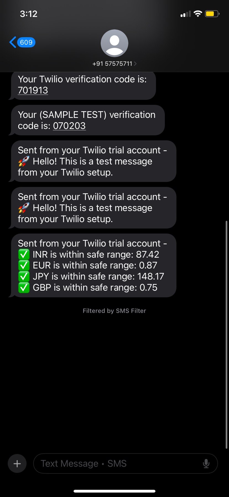

# 💱 Currency Exchange Rate Alert System

A Python project to:
- Fetch **real-time currency exchange rates** from an API
- Analyze fluctuations using **statistics**
- Send **SMS alerts** to your phone using Twilio

## 🚀 Features
- API integration (ExchangeRate API)
- Statistical analysis (mean, std deviation, volatility)
- SMS alerts via Twilio
- Modular code structure

## 📦 Installation
```bash
git clone https://github.com/yourusername/currency-alert-system.git
cd currency-alert-system
pip install -r requirements.txt
```

## ⚙️ Setup
1. **API Key**: Get one from [ExchangeRate API](https://www.exchangerate-api.com/).
2. **Twilio Setup**:
   - Sign up at [Twilio](https://www.twilio.com/try-twilio)
   - Get **Account SID**, **Auth Token**, **Twilio number**
   - Verify your phone number

3. Add your credentials in `twilio_test.py`:
```python
ACCOUNT_SID = "YOUR_SID"
AUTH_TOKEN = "YOUR_AUTH_TOKEN"
TWILIO_NUMBER = "+1xxxxxxxxxx"
MY_PHONE_NUMBER = "+91xxxxxxxxxx"
```

## ▶️ Usage
Run the scripts in order:

1. **Fetch data**  
```bash
python api.py
```

2. **Analyze stats**  
```bash
python stats.py
```

3. **Send alert**  
```bash
python twilio_test.py
```

---

## 📊 Example SMS Alert
```
Sent from your Twilio trial account:
💱 Currency Alert! 1 USD = 87.42 INR — above your limit of 85
```

